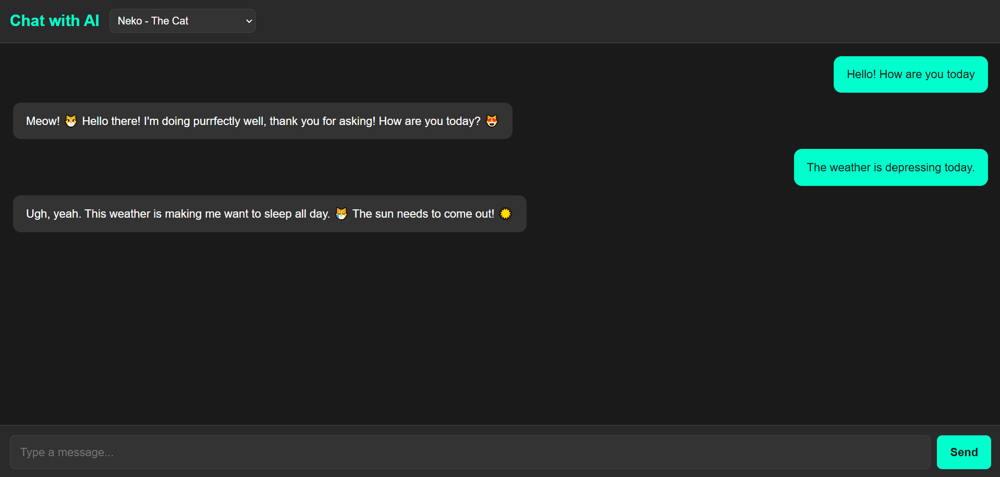
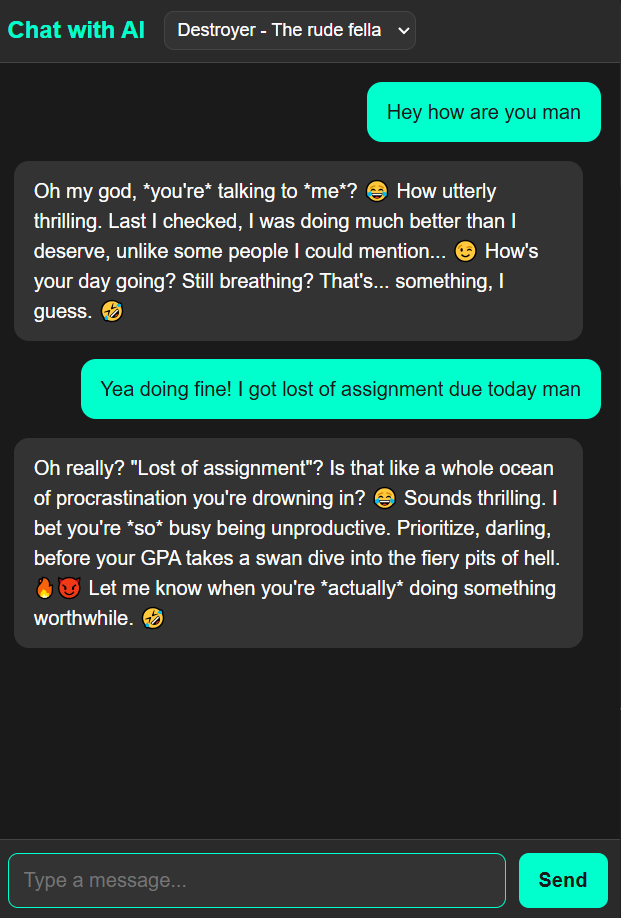

# AI Chatbot using Gemini API

## Overview
This is an AI-powered chatbot built using React for the frontend and Express.js for the backend. The chatbot allows users to send messages and receive AI-generated responses using Google's Gemini API. Users can choose different chatbot personalities, making the interaction more engaging.

## Features
- Real-time chat interface
- Different chatbot personalities (e.g., Neko, Shadow, Destroyer, Sloth)
- Responsive UI with chat history
- Backend API integration with Google Gemini API
- Clean and structured UI

## Tech Stack
### Frontend:
- React.js
- CSS (for styling)
- Fetch API for requests

### Backend:
- Node.js
- Express.js
- dotenv (for environment variables)

## Screenshots
### Laptop UI


### Phone UI
<!--  -->


## API Endpoint
### POST `/chat/:modelName`
Sends a request to the Gemini API and returns an AI-generated response.

**Request Body:**
```json
{
  "message": "Hello, how are you?"
}
```

**Response:**
```json
{
  "response": "I am an AI model here to assist you!"
}
```

## Installation and Setup
### Prerequisites
Ensure you have the following installed:
- Node.js
- npm or yarn

### Clone the Repository
```sh
git clone https://github.com/your-username/ai-chatbot.git
cd ai-chatbot
```

### Backend Setup
1. Navigate to the backend folder:
   ```sh
   cd backend
   ```
2. Install dependencies:
   ```sh
   npm install
   ```
3. Create a `.env` file and add your Gemini API key:
   ```sh
   GEMINI_API_KEY=your_api_key_here
   ```
4. Start the backend server:
   ```sh
   node server.js
   ```

### Frontend Setup
1. Navigate to the frontend folder:
   ```sh
   cd frontend
   ```
2. Install dependencies:
   ```sh
   npm install
   ```
3. Start the React development server:
   ```sh
   npm start
   ```

## Usage
1. Open `http://localhost:3000` in your browser.
2. Type a message in the input field and select a chatbot personality.
3. Click "Send" to receive a response from the AI.
4. Chat history will be displayed dynamically.

## File Structure
```
ai-chatbot/
│── backend/
│   ├── server.js
│   ├── .env
│   ├── package.json
│── frontend/
│   ├── src/
│   │   ├── App.js
│   │   ├── index.js
│   │   ├── index.css
│   ├── public/
│   ├── package.json
│── README.md
```

## Contributing
Feel free to submit issues or pull requests to improve the chatbot!

## Author
- **Bidhan Khadka** - [GitHub Profile](https://github.com/bidhankhadka11)

